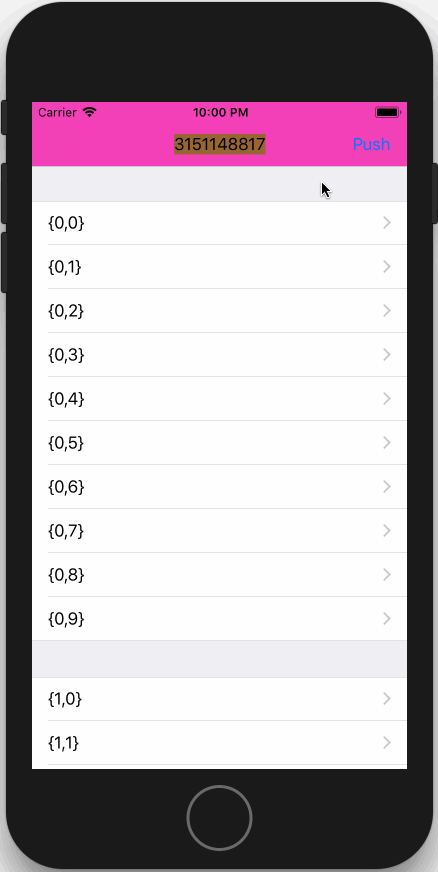

# NavigationContainer

[]()
[]()
[]()
[]()

> 为每个控制器配置单独的导航栏

如果喜欢可以给个 `Star`，如果遇到问题请提交 Issues。

由于一开始就是为了项目重构而设计的，在尽量保证不入侵现有代码的情况下，无缝接入；所以针对性比较强，主要是针对下面的UI结构进行设计的，其他场景暂时未测试；当然了，暂时也不提供太多的定制化。


现有项目的UI层级结构：
```
UITabBarController
	│
	└── UINavigationController
	│		│
	│		└── UIViewController
	│
	└── UINavigationController
	│		│
	│		└── UIViewController
	│
	└── UINavigationController
	│		│
	│		└── UIViewController
	│
	└── UINavigationController
			│
			└── UIViewController
```
从上面可以看出项目根控制器就是一个 `UITabBarController`，管理着四大模块，每个模块的根控制器又是一个 `UINavigationController`，这也是一个很典型的结构了。

现在，我只需要将四大模块的根控制器 `UINavigationController` 替换成 `XPRootNavigationController` 就基本完成了接入工作；

为什么说基本呢，因为到目前为止虽然每个控制器都有了单独的导航栏，但是失去了原有经过定制的导航栏样式，接下来就需要恢复原来的导航栏样式，只需定义 `kXPNavigationControllerClassName` 这个宏即可：
```ObjC
#define kXPNavigationControllerClassName    @"YourNavigationController"
```

当然，如果你的返回图标也是需要定制的话，可以设置 `backIconImage` 这个属性；

至此，整个接入工作就算完成了。

之前的导航栏怎么用，现在也照样还是怎么用，该用代码 push/pop 那你就照样 push/pop，Storyboard 里该怎么拖线跳转则还是照样直接拖线即可，你就当没这茬就行。这就是我要的效果。

## 特性

- 接入成本低，只需将你项目中的 `UINavigationController` 替换成 `XPRootNavigationController` 即可

- 轻松控制状态栏样式，控制器重写 `-preferredStatusBarStyle` 方法并返回所需样式即可

- 轻松隐藏 iPhone X 的 `Home Indicator`， 控制器重写 `-prefersHomeIndicatorAutoHidden` 并返回 `YES` 即可

- 轻松定制返回图标，每个控制器都可以拥有不一样的图标（只要你喜欢），内部将按照以下优先级从高到低来获取返回按钮图标：
	- 当前控制器的 `backIconImage` 属性
	- `-xp_navigationControllerClass` 方法返回的导航栏控制器的 `backIconImage` 属性
	- `XPRootNavigationController` 的 `backIconImage` 属性
	- 如果以上的 `backIconImage` 都为 `nil`，则 `XPRootNavigationController` 内部会自动绘制一个返回图标

- 兼容 UINavigationController 的 push/pop 操作，你无需调用额外接口，只需按照原有方式编写代码即可：
	- [self.navigationController pushViewController:vc animated:YES];
	- [self.navigationController popViewControllerAnimated:YES];
	- [self.navigationController popToViewController:vc animated:YES];
	- [self.navigationController popToRootViewControllerAnimated:YES];
	- 同样也支持 `Storyboard` 中的拖线方式

- 轻松定制导航栏外观，你通过 `kXPNavigationControllerClassName` 这个宏设置了导航栏的默认样式，但是总有那么个别页面导航栏风格迥异；别怕，你只需在控制器中重写 `-xp_navigationControllerClass` 方法并返回新的 `UINavigationController`或其子类 即可，你爱怎么定制就怎么定制

- 不需要导航栏？那直接隐藏即可 `[self.navigationController setNavigationBarHidden:YES animated:NO];`
	- 如果在 `viewDidLoad` 中设置无效，那么你不妨在 `-viewWillAppear:` 方法中试试

- 支持系统原生 pop 手势

## TODO

- 测试其他场景下的使用效果
- 考虑提供更多定制化，或许吧，毕竟本来就是本着简单易用的目标去做的，搞太复杂了就违背初衷了

## GIF演示



## 与 `FDFullscreenPopGesture` 库手势冲突的解决方案

如果你的项目使用了该库，你会发现全局 pop 手势有时候正常，但是偶尔也会抽风似的，手指刚开始滑动，就自动返回上一页了；
请找到 `XPContainerViewController` 的初始化方法，自行添加以下代码：

```ObjC
- (instancetype)initWithViewController:(UIViewController *)viewController {
    if (self = [super init]) {
        ...
        
        // 解决`FDFullscreenPopGesture`全局pop引起的奇怪问题
        navigationController.fd_fullscreenPopGestureRecognizer.enabled = NO;
        navigationController.fd_interactivePopDisabled = YES;
        navigationController.fd_viewControllerBasedNavigationBarAppearanceEnabled = NO;
        self.fd_interactivePopDisabled = YES;
    }
    return self;
}
```
添加上述代码后就能愉快地使用全局 pop 手势了～～～


## 致谢

- [RTRootNavigationController](https://github.com/rickytan/RTRootNavigationController.git)
- [FDFullscreenPopGesture](https://github.com/forkingdog/FDFullscreenPopGesture.git)
	- 支持全局 pop 手势

感谢他们对开源社区做出的贡献。

## 协议

被许可在 MIT 协议下使用，查阅`LICENSE`文件来获得更多信息。